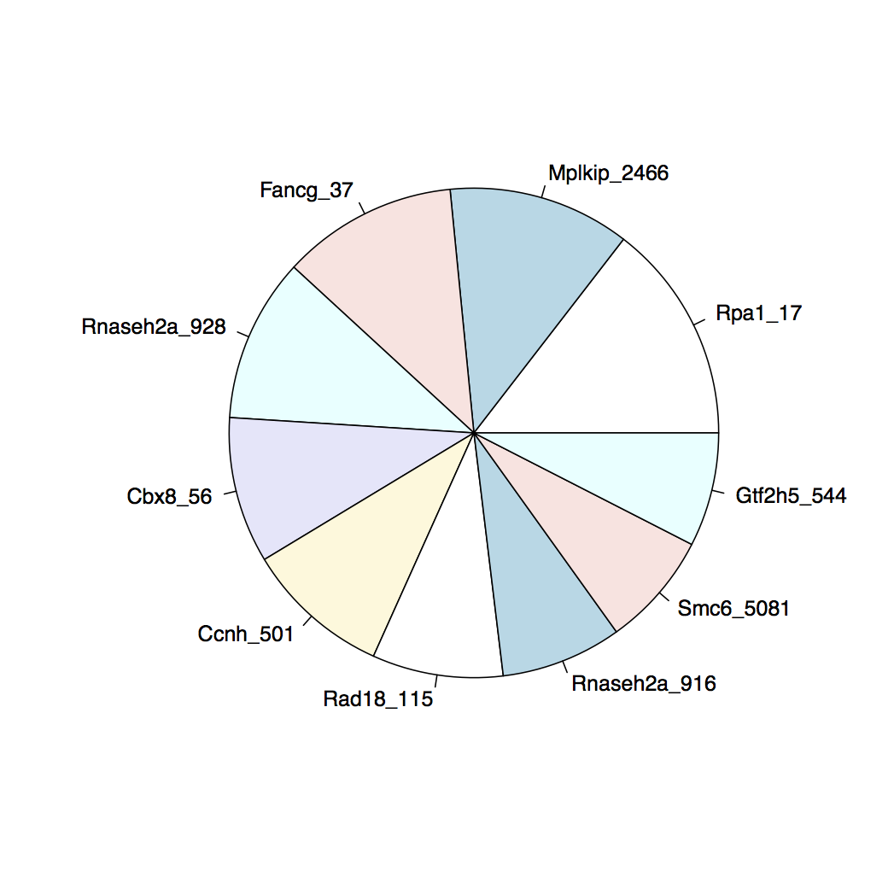

# Lab1: Pooled RNAi pipeline

## Preliminaries: paths, conventions

Please __READ/LISTEN CAREFULLY__ to the following.

### Data paths

First check that the data for the Labs has been loaded correctly. Do the following: 

```bash
$ md5sum /share/data/compgen2016/day45_Intro2Seq_VarCalling/genomes/H.Sapiens/b37_hl/b37_hl.dict
```

and you should see:

```bash
bc303533c68cf74b6f2c705f3d86398c  /share/data/compgen2016/ /b37_hl.dict
```

where I have drop part of the long path for clarity. 

Now this directory:

* `/share/data/compgen2016/day45_Intro2Seq_VarCalling`

is both long and also going to be used over and over again. There are many ways of dealing with this in UNIX. We are going to create a `config.sh` script that will store and name this and other paths for easy refernce and quick loading. 

In you `home` directory (`/home/guest`) create a `Day45` sub-directory and then two more sub-sub directories: `code`, `results`

You can do this most simply by:

```bash
$ cd # This takes you home
$ mkdir Day45
$ mkdir Day45/code
$ mkdir Day45/results
$ cd Day45/code
```

You should now be in the code subdirectory (check with pwd). Now create/edit a file called `config.sh` and in it put:

```bash
# Compgen2016 Day 4,5 configuration file

# Path to root of lab data directories

ROOT45=/share/data/compgen2016/day45_Intro2Seq_VarCalling
```

Once you have this file you want to `source` it so those variable will be set in your current shell environment. Do the following:

```bash
$ source ~/Day45/code/config.sh
```

and to make sure everthing is working redo the checksum but this time use the `$ROOT45` variable:
```bash
$ md5sum $ROOT45/genomes/H.Sapiens/b37_hl/b37_hl.dict
bc303533c68cf74b6f2c705f3d86398c  /share/data/compgen2016/...
```


## Intro

While most next generation sequencing analysis pipelines require the data to be mapped to a target genome there are some pipelines that can be done without any alignment step. One such problem is the analysis of pooled shRNA experiments such as in *Zuber, et. al, 2011*[^Zuber2011]

In this experiment a library of hairpins is introduced into a population of cells and depending on which hairpin gets incorporated that particular cell my grow or die. By sequencing using primers specific to the hairpin constructs you can determine which shRNA lead to proliferation and survival or arrest. 

## Sequence design

A typical shRNA construct will look as follows;


For this exercise we will focus on a core region that contains the following sequence elements:


The shRNA sequence goes from position 1 to 22. There is an index sequence that for this example is fixed and is from position 23 to 28 and then an adapter sequence. 

Given a FASTQ file of sequences we want to count the abundance of the shRNA sequences in it. shRNA's with higher abundances may indicate that the gene targeted by them is potentially responsible for limiting cell proliferation (i.e., repressing it activates growth)


## Description of Pipeline

The basic outline of the pipeline is as follows

* *Quality Trim* to make sure we have high enough Q's at the adapter region. We will trim to a high Q (Q>30) and since we will be using it in a subsequent step we want to make sure we do not trim away the INDEX sequence so set a minimum length after trimming to retain it.

* Convert from *FASTQ to FASTA*
	
* *Clip* Index Sequence, discard sequences without an adapter (quality control) in them or shorter than the length of the shRNA piece.

* *Collapse* multiple occurrences of the same sequence and get the counts

* Re-*format* the FASTQ file into a tabular format

* Join/annotate shRNA sequences.

The first 5 steps of this pipeline can be done either with programs from the FASTX tool kit or with a custom script/program. The last step will require some programming, but should be doable in R, python or perl and should be simple in any programming langage with decent I/O and string capabilities. 

The input for this pipeline is at:

```bash
	$ROOT45/Labs/1_Sequencing/data/shRNA_Experiment1.fastq.gz
```

where `$ROOT45` is the path we set in the _Preliminaries_ section. If this is not setup correctly ask for help.

You can find a manual for all the FASTX commands either online at:

> http://hannonlab.cshl.edu/fastx_toolkit/commandline.html

or there is a local copy in the course repository at

> `$ROOT45/Labs/man/FASTX/fastxMan.html`

which you should be able to open in any browser.

## Option 1

If you are not yet comfortable with the UNIX command line and programming then I suggest skipping to the next section: __Pipeline Walkthrough__. In that next section I will step through building this pipeline from the FASTX toolkit programs. 

However, for people already comfortable with the command line and programming I strongly suggest trying to figure out how to code the pipeline from the description above. Find where the FASTX tool kit is installed in your system with
```
	which fastq_to_fasta
```

if you see nothing then it is not on your path and you will need to find it and add it to your path. 

Then browse the commands available and there features by either `ls`-ing that directory and running the commands with the `-h` option: 
```
	fastq_to_fasta -h
```

or use the manual pages linked above and try to build the pipeline. Although you can get something built in less than steps you should use **5** different commands from the toolkit. 

If you run into a snag then just move to the next section. If you do complete the pipeline skip to __Final Steps__.

## Pipeline walkthrough

### Preamble

Although it is usually a really bad idea to do pipelines as command line one liners; for pedagogical reasons we will do exactly that here. The input file is small enough that repeated re-running should not be an issue. However if you feel more comfortable encapsulating the commands in a script then please do so. Make sure if you are going to go the one liner route you understand how to use the command history; in particular how to repeat previous commands. Make sure either CTRL-P or up-arrow work as expected.

First make sure the FASTX toolkit is on your path. You can do this typing:
```
	fastq_to_fasta -h
```

you should see something like
```

usage: fastq_to_fasta [-h] [-r] [-n] [-v] [-z] [-i INFILE] [-o OUTFILE]
Part of FASTX Toolkit 0.0.13.2 by A. Gordon (gordon@cshl.edu)

   [-h]         = This helpful help screen.
   [-r]         = Rename sequence identifiers to numbers.
   [-n]         = keep sequences with unknown (N) nucleotides.
                  Default is to discard such sequences.
```

... (your version number may be different)

If not or you get an error ask for help. Now check that you can re-run this command using one of the history re-run command methods: 

* Up-arrow

* CTRL-p

In fact re-run that command and then reselect it and edit it to run:
```
	fastx_renamer -h
```

if you new to unix and are having trouble with this ask for help. 

### Intermediates: pipes or files

The walk through is going to be using UNIX pipes to chain together the various commands. If this is too complex or confusing or you want to capture the intermediates you can use I/O redirection
```
COMMAND <INPUT >OUTPUT
```
	
or if you look at the help screen you will see that most the FASTX commands allow you to specific the input and output file with:
```
   [-i INFILE]  = FASTA/Q input file. default is STDIN.
   [-o OUTFILE] = FASTA/Q output file. default is STDOUT.
```

ie, they default to standard input and standard output but you can explicitly set the input and output files or just one or the other. 

### Step 1: find input, create a work space

First step is to find the input file: `shRNA_Experiment1.fastq.gz`. If the course files were installed in your home directory then it should be here:
```
	$HOME/Intro2NextGen/1_Sequencing/data/shRNA_Experiment1.fastq.gz
```

verify that is is there by doing the following:
```
	file $HOME/Intro2NextGen/1_Sequencing/data/shRNA_Experiment1.fastq.gz	
```

and you should see something like
```
.../Intro2NextGen/1_Sequencing/data/shRNA_Experiment1.fastq.gz: gzip compressed data, from Unix, last modified: Thu Oct 15 18:09:05 2015, max compression
```

if you get an error (No such file or directory) ask; there should be a live update as to where these files are. If you are feeling adventurous you can look for it with
```
	find $HOME | fgrep shRNA_Experiment1.fastq.gz
```

Once you are sure you have the file code the first step of the pipeline. Note; that files ends with a `.gz` extension. That means the file is compressed (to save space). DNA sequence data is highly redundant and actually compresses quite well. However even compressed the files are usually huge so almost always you will be dealing with compressed files. 

You could uncompress it but for this exercise since we will be using pipes extensively let's just take a look at the top of the file with
```
	zcat $HOME/Intro2NextGen/1_Sequencing/data/shRNA_Experiment1.fastq.gz | head
```

`zcat` is like `cat` but decompress first (most systems also have `zmore`) and `head` just gives the first 10 or so lines. You should see:
```
@COMPGEN:Set1:201510:4:1105:16154:58520 1:N:0:
TCCAATCTTTTCAGAGTCTGAATACATCTGTGGCTTCACTACCAGATCGT
+
BBBFFFFFHHHHHJIJDGHJJIJIJJGIHBEFHFHIIGIEHGIICGFGHD
@COMPGEN:Set1:201510:4:1105:16052:58552 1:Y:0:
CCCTAGTGAATATTTATTATGAAACATCTGTGGCTTCACTACCAGAACGC
+
==>;AA+2AA@=><=@7,?>>=,@3?+<<+@++2AB;@@@A7A>B#####
@COMPGEN:Set1:201510:4:1105:16106:58578 1:Y:0:
ACCATAGCATATATCAATGTAATACATCTGTGGCTTCACTACCAGATCGT
```

### Step 2: Quality Trim

Note strictly necessary but it is often a good idea to quality trim the data. Trimming means remove bases from the sequence that have a Q value below a given threshold, starting from the 3' end and moving to the 5' end. Once you hit a pass that passes the threshold you stop and even if there are low Q bases to the 5' end of this one the trimming ends here. So the first step is to use the trimmer. You are going to use the following command
```
	fastq_quality_trimmer -h
```

Take a look at the options and see if you can guess what you will need. We want to trim to baseQ 30 and discard sequences that are shorter then 28 because those will not longer have intact INDEX sequences (see figure above). Try to work out the options but here is the command you want:
```
	zcat $HOME/Intro2NextGen/1_Sequencing/data/shRNA_Experiment1.fastq.gz | fastq_quality_trimmer -t 30 -l 28 -Q33 -v | head
```

That command is so long it is not readable so here are two very, *very*, useful UNIX features. One variables. You can set the name of that file as a variable and use that instead:
```
	INPUT=$HOME/Intro2NextGen/1_Sequencing/data/shRNA_Experiment1.fastq.gz
```

Now you can say:
```
	zcat $INPUT | fastq_quality_trimmer -t 30 -l 28 -Q33 -v | head
```

and you should see:
```
@COMPGEN:Set1:201510:4:1105:16154:58520 1:N:0:
TCCAATCTTTTCAGAGTCTGAATACATCTGTGGCTTCACTACCAGATCGT
+
BBBFFFFFHHHHHJIJDGHJJIJIJJGIHBEFHFHIIGIEHGIICGFGHD
@COMPGEN:Set1:201510:4:1105:16052:58552 1:Y:0:
CCCTAGTGAATATTTATTATGAAACATCTGTGGCTTCACTACCAG
+
==>;AA+2AA@=><=@7,?>>=,@3?+<<+@++2AB;@@@A7A>B
@COMPGEN:Set1:201510:4:1105:16106:58578 1:Y:0:
ACCATAGCATATATCAATGTAATACATCTGTGGCTTCACTACCAGATCG
```

*N.B.* the second sequence was trimmed. 

What do the options means? You should look at the help screen and convince yourself they are what we want. But why `-v`; what is verbose? It just prints some statistics how many sequences were discard because they were two short after trimming. That info goes to standard error if your are worried about it messing up the pipeline. If you want to see it do:
```
	zcat $INPUT | fastq_quality_trimmer -t 30 -l 28 -Q33 -v >/dev/null
```

and you should see:
```
Minimum Quality Threshold: 30
Minimum Length: 28
Input: 100000 reads.
Output: 99078 reads.
discarded 922 (0%) too-short reads.
```

But what is that `-Q33` thing. You are not missing it; it is not in the help description. Leave it off and see what happens:
```
fastq_quality_trimmer: Invalid quality score value
(char '+' ord 43 quality value -21) on line 8
```

A little special easter egg from the FASTX people. FASTX is fairly old toolkit written in the days when Illumina decided to use their own conventions for encoding quality scores in this case PHRED+64. FASTX defaults to that. However, Illumina finally moved to the standard convention that everyone uses now and all current data is encoded in the PHRED+33 scale. So `-Q33` tells the program that. 

If you still confused about this issue check out the wiki page: https://en.wikipedia.org/wiki/FASTQ_format


### Convert to FASTA and clip adapter

We are done with the qualities so we can convert from to FASTA format now and then trim out the adapter. The two programs to do this are
```
	fastq_to_fasta
	fastx_clipper
```

And here is the pipeline up to this point:
```
	zcat $INPUT | fastq_quality_trimmer -t 30 -l 28 -Q33 -v | fastq_to_fasta -Q33 -v | fastx_clipper -a TACATC -c -l 22 | head
```

Again the line is unreadable long so we use another unix convention:
```
	zcat $INPUT | fastq_quality_trimmer -t 30 -l 28 -Q33 -v \
	| fastq_to_fasta -Q33 -v \
	| fastx_clipper -a TACATC -c -l 22 \
	| head
```

If you end a line with a backslash (`\`) and __immediately__ type return then you do not execute the command but rather the shell starts a new line and lets you continue typing. You __must__ not have a space after the backslash.

If everything worked you should see:
```
>COMPGEN:Set1:201510:4:1105:16154:58520 1:N:0:
TCCAATCTTTTCAGAGTCTGAA
>COMPGEN:Set1:201510:4:1105:16052:58552 1:Y:0:
CCCTAGTGAATATTTATTATGA
>COMPGEN:Set1:201510:4:1105:16106:58578 1:Y:0:
ACCATAGCATATATCAATGTAA
>COMPGEN:Set1:201510:4:1105:16098:58591 1:N:0:
CACTAAGTAAATGTTTAATCAA
>COMPGEN:Set1:201510:4:1105:16162:58613 1:N:0:
TCATTTCCATTTTACAAGATAA
```

### Last step: no pipes alternative

While this pipeline will be done with pipes as I said it can also be done with saving intermediate files. Here are two versions of the previous piece but this time saving intermediate results to a file. 

#### version 1: use file redirection

With file redirection
```bash
	zcat $INPUT > step0.out
	fastq_quality_trimmer -t 30 -l 28 -Q33 -v <step0.out >step1.out
	fastq_to_fasta -Q33 -v <step1.out >step2.out
	fastx_clipper -a TACATC -c -l 22 <step2.out >step3.out
	head step3.out
```

The fastx tools also permit another option; use their command line input/output options
```
	zcat $INPUT > step0.out
	fastq_quality_trimmer -t 30 -l 28 -Q33 -v -i step0.out -o step1.out
	fastq_to_fasta -Q33 -v -i step1.out -o step2.out
	fastx_clipper -a TACATC -c -l 22 -i step2.out -o step3.out
	head step3.out
```

You may ask why do `zcat` and write a separate file instead of `gunzip` and decompress the `$INPUT`. This is not a hard rule; but I have a strong preference not to modify original/raw input files in anyway. In fact at MSKCC the sequence archive were all sequence data is stored is READ-ONLY; to prevent anyone from accidentally or intentially modify any of the *raw* data. Using `gunzip` would modify the original input file (which where I work is not even possible).

## Collapse and re-format

The steps up to this point are actually fairly common in many sequence processing pipeline (except for the conversion from FASTQ to FASTA) and at this point we have trimmed/clipped sequences which in most situation we would now mapped to the appropriate genome. However in this case mapping is unnecessary. The sequences are from a designed screen so we know what they are (and what genes they target) already based on just the sequence. What we want to know is from the starting pool for roughly equally proportioned hairpins which ones were enriched and which were depleted. Simply we want to count them and there is a tool to do that: `fastx_collapser`. Although not obvious from its name `fastx_collapser` will collapse multiple copies of the same sequence and will also give you the counts of how many times  that copied was in the file. 

Add this step the pipeline with:
```
	zcat $INPUT | fastq_quality_trimmer -t 30 -l 28 -Q33 -v \
	| fastq_to_fasta -Q33 -v \
	| fastx_clipper -a TACATC -c -l 22 \
	| fastx_collapser \
	| head
```

and you should see:
```
>1-1222
CCTAGTGAATATTTATTATGAA
>2-1011
CACTAAGTAAATGTTTAATCAA
>3-976
GAAGGATAAATTAGTAACTTAA
>4-911
TACATACATAAATCATTCTTTA
>5-812
TCTAATAGAAAATAGAACTCTA
```

Were the numbers in the FASTA description line indicate the rank of the sequences counts and the raw count itself; i.e., there were 1,222 copies of the first sequence. 

Technically we are now done, we have the counts, but that is not the more useable of formats. In almost all pipelines the minimal, raw output is often not the most workable so there will often be a number of post-processing steps. One last one using the FASTX tools kit is to convert the FASTA file to a table. 
```
	zcat $INPUT | fastq_quality_trimmer -t 30 -l 28 -Q33 -v \
	| fastq_to_fasta -Q33 -v \
	| fastx_clipper -a TACATC -c -l 22 \
	| fastx_collapser \
	| fasta_formatter -t \
	> countsTable.txt
```

This is the end of this stage of the pipeline so we write the file to save it for later use. To see what is in there use the head command: `head countsTable.txt`
```
1-1222	CCTAGTGAATATTTATTATGAA
2-1011	CACTAAGTAAATGTTTAATCAA
3-976	GAAGGATAAATTAGTAACTTAA
4-911	TACATACATAAATCATTCTTTA
5-812	TCTAATAGAAAATAGAACTCTA
6-809	TACTACTTATACAACAACTTAA
7-727	TTGCATATTCATTGATAAATAA
8-671	CTACAGTGTACTTACATACATA
9-637	GAGAATGTATTCTTAGAATACA
10-633	TTAAGTGTTATTTGTTATTAAA
```

Not the most greatest format but a least is a much more easily parseable table.

## Final Steps

While the sequences identify the shRNA uniquely a much nicer table for humans would look like this:

Counts|Sequence|GeneTarget
-----|--------|----------
1222|	CCTAGTGAATATTTATTATGAA|	Rpa1_17
1011|	CACTAAGTAAATGTTTAATCAA|	Mplkip_2466
976	|	GAAGGATAAATTAGTAACTTAA|	Fancg_37
911	|	TACATACATAAATCATTCTTTA|	Rnaseh2a_928

Where the identity of the sequences is stored in the file `shRNA_Library.fasta` which is in the same directory as the input FASTQ file. 

There is no way to do this with the FASTX toolkit. It could be done with a crazy awk or perl one liner. But at this point it is best to write a real program. And since it is likely we are going to be some some sort of statistical analysis on this data it might be best to do this last step in `R` but if you do not like working with strings in `R` you could write a short python or perl (or whatever) script that takes the table from the pipeline and the library file and output this file 

However to tie things together and to complete this get the table and gene names into R and make a pie chart of the top 10 shRNA's. 




## Extra credit

The FASTX toolkit is very useful but it is very old and not longer actively maintained. In particular the clipper (`fastx_clipper`) has some very odd behavior and also does not work with PairEnd data; it also is not deterministic (ie you get different answer). From the author himself:

> The fastx-clipper was designed to work with short reads (e.g 36nt or 50nt), and be very-sensitive (and somewhat less specific) - it will not perform well with longer reads. I'd recommend trying other clipping programs (e.g. "cutadapt")

You definitely want to use a more modern adapter. Some alternatives are:

* cutadapt

* TrimGalore (wrapper around cutadapt with defaults)

So if there is time try the following exercise

* Rewrite the above pipeline to not use `fastx_clipper`. Ask if you need a hint but think about it first.

* Find and install an alternative adapter clipper

You can use the following dataset which is miRNA sequenced to 50bp so every sequence has the adapter in it. This is the Illumina SmallRNA adapter sequence. 

> \>smallRNA 3' Adapter
> tggaattctcgggtgccaaggaactccagtcaca

and you can find the miRNA data at:
```
	$ROOT/Intro2NextGen/1_Sequencing/data/miRNA_Dataset.fastq.gz
```


* Or if you just want to practice more with FASTX use it to clip this data set which is what fasts was optimized for. 

* Use the pipeline above (or your own program) to count miRNA sequences; *N.B.* miRNA are not all the same length so the pipeline I did above will work with miRNA but if you did a short cut pipeline that just extracted the shRNA sequence directly instead of clipping it will not work for miRNA. 

## References

[^Zuber2011]: Toolkit for evaluating genes required for proliferation and survival using tetracycline-regulated RNAi. Nat Biotechnol. 2011 Jan; **29**(1): 79–83. [PMC3394154](http://www.ncbi.nlm.nih.gov/pmc/articles/PMC3394154/)

