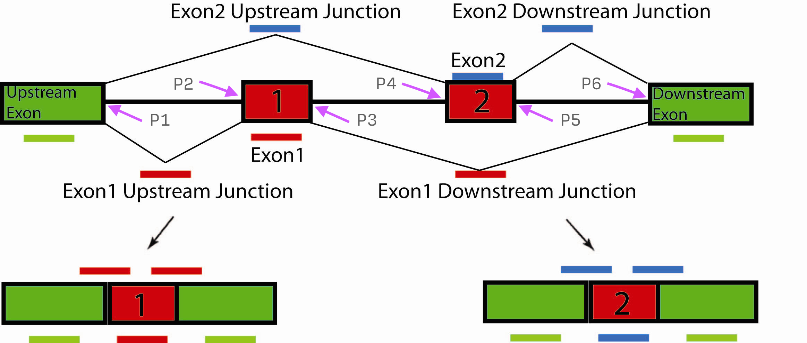

# RNA mapping with STAR
 
## Build STAR index

You can just skim this section if you want to use the pre-built indexes. 

As with the DNA mappers you first need to build an index. However with many of the RNA mappers there is an extra piece of info you can use. In addition to the genome sequence STAR can also build an index using junction information. A junction is simply a file that tells the index builder where all the exon-exon junction are in the genome for all genes.  

For example in the following image this gene has two possible transcripts



So for this gene you would have in the junction database

5' | 3'
---|---
P1 |P2
P3 |P6
P1 |P4
P5 |P6

This data is often called the *Gene Model* (or part of the Gene Model). There are several ways of specifying all known junctions or the Gene Model for a genome but the most common is to use a GTF file which is a variant of a GFF file with some extra structure. GFF/GTF files are a very important file format for genome annotation. You will see more of them in the RNA series.

So you have a choice, you can:

1) Build a junction _free_ index using just the genome sequence file 

2) Build an index with junctions using the GTF supplied. A GTF with just the genes on chromosomes of our reduced build is at:

```
$ROOT45/genomes/H.Sapiens/b37_hl/gtf/gencode.v18.annotation.dedup.highlightChr.gtf
```

One last headache. STAR requires you tell it what it cryptically calls:
```
	--sjdbOverhang
```

Which in the later version of the STAR manual is better explanied:
> --sjdbOverhang specifies the length of the genomic sequence around the annotated junction to be used in constructing the splice junctions database. Ideally, this length should be equal to the ReadLength-1, where ReadLength is the length of the reads. For instance, for Illumina 2x100b paired-end reads, the ideal value is 100-1=99. In case of reads of varying length, the ideal value is max(ReadLength)-1. In most cases, the default value of 100 will work as well as the ideal value.

You can use 100 (99) as he recommends but max(ReadLength) for the data in this course is 76 so you can use 75. 

The drawback to making `sjdbOverhang` very large to deal with any concievable possible length is that is increase the size of the index which much be stored in memory while the program is running so you really do not want to make it any larger than necessary.

## Map test dataset

Using your own index or if you ran into trouble you can use the prebuilt ones. If you are using the prebuilt ones you should add the following lines to the `config.sh`
```bash
# Note for STAR you need to pick
#    NoGTF
#    Gencode_75
GENOME_STAR=$GENOME_ROOT/index/star
```

And to get the different genomes you can use:

* `$GENOME_STAR/NoGTF` 

to get the junction free one

* `$GENOME_STAR/Gencode_75` 

which is index built with genecode GTF and overhang of 75.

The sequence data is located at:
```
	$ROOT45/Labs/2_Mapping/data/gencodeTest2_Q30_1_R1.fastq.gz
	$ROOT/Labs/2_Mapping/data/gencodeTest2_Q30_1_R2.fastq.gz
```

It is paired end data. Also STAR does not read compress files by default so you will need to use the `--readFilesCommand` option with `zcat` for LINUX/UNIX and `zcat` for MAC OS X.

STAR also writes a alot of files; not just the output SAM like BWA. So I suggest you create an output directory; maybe call it OUT (`mkdir OUT`) and use the option:
```bash
	--outFileNamePrefix OUT/
```

Note, that trailing slash (/) is necessary. Leave it off and see what happens; you may prefer that convention of naming files. 

The output will be called `Aligned.out.sam` and will either be in the current directory or the one specified with the outFileNamePrefix option. 

One last option to use that is not necessary but if you want accurate mapping statistics from PICARD then use:
```
	--outSAMunmapped Within
```

BWA outputs unmapped reads automatically; STAR does not. This options tells STAR to do so. If you do not use it then PICARD will not be able to compute percent mapped on the output. 

