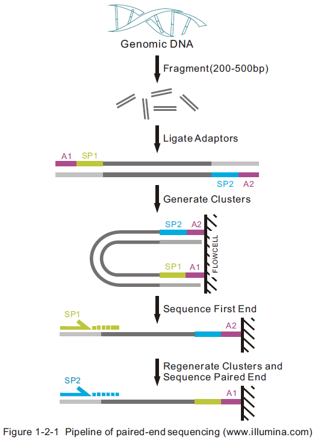

# Module 1: Technology

# Overview


# Computer Stuff

- All the stuff in the middle involves heavy use of computers

	- No way to avoid it
	
- But to many that stuff in the middle is impenetrable

	- And often computer/math/physics types are not all that helpful
	
# Obtuse and Obfuscated


# Here to help

- Or at least try

# Introduction to sequencing technologies

# Manditory Growth Slide


# Multiple technologies

* Illumina 

* SOLiD

* 454 (successor Ion Torrent)

* PacBio

# Technology comparison


# Illumina

## Sequencing by synthesis


# SOLiD

## Sequencing by ligation


# 454/IonTorrent

## Pyrosequencing (H+ sequencing)


# PacBio

## Single molecule sequencing (sequencing by video)


# Accuracy

- Sanger > SOLiD > Illumina >> 454/IonTorrent >> PacBio

	- 454/IonTorrent problem with homopolymers

	- However with the exception of Sanger read length goes up as you move to the right. Less accuracy but longer reads

# pyrosequencing homopolymer problem

- Affects 454 and IonTorrent

- Because it reads multiple runs of the same base in one cycle there is a signal to noise issue;

	- Need to discriminate $(N-1)/N$
	
		- threshold is like ($1/N$)
	
	- This gets very hard as $N$ gets large
	
	- Practical limit 5-8 mers
	
	- But when 2mers are issues

# Paired End Sequencing


# Paired End Sequencing, II



# Applications of NGS

- RNAseq

- ChIPseq

- other not discussed

	- Whole Exome (targeted) sequencing (WES)
	
	- Whole Genome Sequencing (WGS)
	
	- BiSulfite
	
	- Target PCR based

# RNAseq library types (for ChIPSeq guys)

- From a bioinformatics view you need to know (you really do)

	- Poly-A unstranded (Illumina TruSeq Poly-A Selection)
		- Unstranded

	- SMARTer Amplification
		- Strand Forward, FIRST_READ_TRANSCRIPTION_STRAND

	- KAPA mRNA Stranded
		- Strand Reverse, SECOND_READ_TRANSCRIPTION_STRAND

	- Ribo-minus (Illumina TruSeq RiboDeplete)
		- Strand Reverse, SECOND_READ_TRANSCRIPTION_STRAND
	
# Illumina True Seq RNAseq


# Two different ChIP libraries

- From a bioformatics view you know

	- Focal Binding ChIP: Ie protein binding is strongly localized
	
		- Transcription Factors
	
	- Diffuse Binding ChIP: binding is weak-localized
	
		- Histone (chromotin) or Methyl binding factors
		
- MACS calls there model and non-model cases

# ChIPseq library prep (for RNAseq guys)


# ChIPseq library prep


# ChIPseq library prep


# ChIPseq library prep


# ChIPseq library prep


# Sequencing data file formats: FASTA/FASTQ

## Original format: FASTA

- For both xNA (nucleotides) and AA (proteins)

- Basic structure:

```
>gi|31563518|ref|NP_852610.1| microtubule-associated 
MKMRFFSSPCGKAAVDPADRCKEVQQIRDQHPSKIPVIIERYKGEKQ
LPVLDKTKFLVPDHVNMSELVKIIRRRLQLNPTQAFFLLVNQHSMVS
VSTPIADIYEQEKDEDGFLYMVYASQETFGFIRENE
```

# FASTA, cont.

- Can encode multiple sequences

```
>SEQUENCE_1
MTEITAAMVKELRESTGAGMMDCKNALSETNGDFDKAVQLLREKGL
LVSVKVSDDFTIAAMRPSYLSYEDLDMTFVENEYKALVAELEKENE
IPQFASRKQLSDAILKEAEEKIKEELKAQGKPEKIWDNIIPGKMNS
MGQFYVMDDKKTVEQVIAEKEKEFGGKIKIVEFICFEVGEGLEKKT
>SEQUENCE_2
SATVSEINSETDFVAKNDQFIALTKDTTAHIQSNSLQSVEELHSST
ATIGENLVVRRFATLKAGANGVVNGYIHTNGRVGVVIAAACDSAEV
```

# Extension to store quality of reads: FASTQ

- Change delimiter and add an additional line of quality information

```
@SEQ_ID
GATTTGGGGTTCAAAGCAGTATCGATCAAATAGTAAATCCATTTGTT
+
!''*((((***+))%%%++)(%%%%).1***-+*''))**55CCF>>
```

- the 4th line encodes the Quality value (Q) for each base

# Q value / PHRED scale

- The q value is defined to be
$$
Q=-10\log_{10}(P_{err})
$$
where $P_{err}$ is the probability the base is _incorrect_

Q|Perr|Nerr
-|-|-
10|0.1|1 in 10
20|0.01|1 in 100
30|0.001|1 in 1,000
40|0.0001|1 in 10,000

# Q encoding

- The Q value has over time been encoded in different ways


# Q encoding

- ord(c)-33 ==> Q / ord is the ascii value for a character
- chr(Q+33) ==> Character

#Quality Control (Manipulating FASTA files)

* FastQC toolkit: (http://www.bioinformatics.babraham.ac.uk/projects/fastqc/)

* Show Samples

# Unix Crash Course

## History

* First shell, Ken Thompson, *1971* (44yr)

* First (?) UNIX shell, Bourne Shell [SH], Stephan Bourne, 1977

* C-Shell [TCSH], Bill Joy, 1978

* People (especially scientist) have been using some from of a shell to talk to computers for longer that most of people in this room were alive.

* Probably will still be using it after we are gone. 

* Might be good idea to learn it (before SKYNET takes over)

# Google has (nearly) all the answers

* You can pretty much ask Google simple computing questions as get answer almost all the time

* Should really get in the habit of using it

# Where to start

*  Most Commonly Used Commands

 | | | | | 
--|--|--|--|--|--
*fgrep*| 10.81%|**cd**|10.11%|**ls**|8.06%
**more**|7.77%|**cat**|6.39%|**rm**|3.53%
*find*|3.23%|xargs|2.69%|cut|2.67%
egrep|2.41%|mkdir|1.86%|sort|1.76%
git|1.66%|awk|1.66%|wc|1.58%
**head**|1.32%|**mv**|1.26%|bjobs|1.23%
sed|1.22%|*uniq*|1.19%|history|1.00%
vi|0.97%|**pwd**|0.90%|cp|0.90%
tr|0.86%|perl|0.77%|du|0.75%
samtools|0.68%|listCols|0.56%|zcat|0.56%
hg|0.54%|parseLSFLogs.py|0.49%|tee|0.48%
chmod|0.45%|rsync|0.43%|*ln*|0.43%
sudo|0.43%|diff|0.42%|bedtools|0.38%

# Unix I/O conventions

* files / directories 
* commands
* I/O redirection, pipes

# Basic unix commands:

## file / directory

* ls, cd, pwd, cat (more/less), rm, mv, mkdir, rmdir
* wild cards / glob patterns

# Home directory:

```bash
# Go home
cd
```

```bash
# Show home direcotry
cd
pwd

# better (leaves you in where you are)

echo $HOME
```

# Important intermediate commands

## `history`

- list and rerun commands

- `!!` usually replaced by up-arrow (^p)

- history editting replaced with cut-and-paste

# Important intermediate commands
## `man`

- make sure to go over `man`

    - `man -k` == `apropos`

# Important intermediate commands
## `locate`

- make sure to explain caveat that database is **not** updated continuously (usually everyday)

- typically configure to not index user space

    - **NOT** like spotlight

- Mostly useful for system stuff

- works best with `grep`

# Important intermediate commands
## `fgrep`, `egrep`, `grep`

- `fgrep` == fast grep (`grep -F`)
- `egrep` == extended grep (`grep -E`)
	- regular expression crash course
	- like wild cards but different syntax

From man page:

> Direct invocation as either `egrep` or `fgrep` is deprecated,
> but  is  provided  to allow historical applications that
> rely on them to run unmodified.

i.e., for old people

# Unix cautions

- `mv` semantics can be deceptive

```
mv file1 file2
```

This renames `file1` to file `file2` but if `file2` exists it also deletes `file2`

- many people uses alias to redefine defaults to something more forgiving.

For beginners strongly suggest

```
alias mv="mv -n"
```

Probably should also do `alias rm="rm -i"`, but gets tedious pretty quickly

# Parting thought


