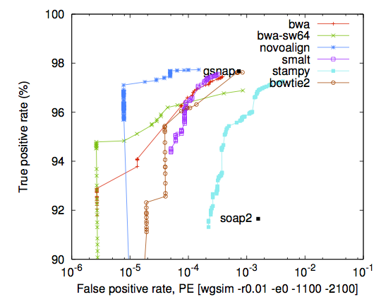

# Module 2: Mapping

## Introduction

## Non-mapping cases

Some pipelines do not require a genomic step

- Pooled shRNA/RNAi/CRiSPER libraries

- k-mer based methods

	- Kallisto, Sailfish

# However, 

- Most bioinformatics pipeline have a mapping step

- Mapping is just sub-string find:
```bash
	Given string s and G over some common alphabet
		Len(s)<=Len(G)
		find pos of s in G
```

which is conceptually a pretty simple problem. 

# 2 complications

- But there are two wrinkles (complications):

	- Size (N): len(G)==N is enormous (3,000,000+ for human)
	and while len(s)==m is usually tiny (50--200) we have $10^8$
	to $10^9$ of them
	
	- Imperfect and/or multiple matches: we want to find the best closest match
	
		- actually want both best and sub-optimal
		- sometimes just one, a few, all
		- most algorithm trade of speed for ability to find all

# Indexes to manage search space

- Dealing with size issue (and mismatches partially)

	- Standard solution when searching in a large space; build index
	
	- For searching strings the index is usually a suffix tree
	
	> In computer science, a suffix tree (also called PAT tree or, in an earlier form, 	position tree) is a compressed trie containing all the suffixes of the given text as their 	keys and positions in the text as their values. Suffix trees allow particularly fast 	implementations of many important string operations.
	(https://en.wikipedia.org/wiki/Suffix_tree)
	
# Suffix Tree

")


- Pros: 

	- search for exact match is $O(m)$

	- search for regular expression is expect sublinear in $N$
	
- Cons:

	- Size: Index way larger than $N$
	
		- Use of BWT transform drastically helps reduce the size issue

# Partial matches

- Imperfect partial matches

	- Long history of work on this; the original sequence (proteins between species) searches look at highly divergent sequences.
	
	- Read Durbin for serious details:
		- Biological Sequence Analysis: Probabilistic Models of Proteins and Nucleic Acids
	
- Pairwise alignments, with mismatches and in/dels

	- Can be stated as finding optimal path through scoring matrix:
	
		- Dynamic Programming

	- Global: Needleman-Wunsch
	
	- Local: Smith-Waterman

# Alignment Algorithms: Pre-next gen methods

## BLAST (Basic Local Alignment Search Tool)
http://blast.ncbi.nlm.nih.gov/Blast.cgi

- Very good a searching for extremely fuzzy (imperfect matches)
- Can index a massive amount of sequence data:
	- Many (all) genomes and known sequence
- Great for things like homology seach.
- Much to slow to use for most next-gen applications
	- We use if for diagnostics to figure out contamination problems

# TaxBLAT


# Pre-next gen methods

## BLAT (BLAST-like alignment tool)

- Designed map large numbers of sequences to a single genome.
- Sequences that are likely to be from that genome
- Much faster than BLAST. 
- Also chains alignments into one consistent piece
	- BLAST will give many individual pieces


# Ultra-fast methods

- MAQ

	- Definition of MAPQ
	- No indels

- Bowtie

	- Many algorithms have Bowtie as their mapping kernel (TopHat; Express)

	- more tweakable (or more easily so) then BWA
	
	- MAPQ score do not follow "expected" form/formula
	
	- Original version did not allow indels

- BWA (successor of MAQ)

	- Work horse in variant detection community

- Bowtie2

# Older methods

- SHRiMP (no longer developed but old favorite)

	- Very tweakable

	- Native COLOR space support (ie reads in FASTA genome; no double encodeing non-sense)

	- Actually has a useful non-standard output mode (alignment); 
	more easily parsed cigar string

	- work well for intermediate length reads

	- very, very slow compared to BWA/BOWTIE

# Many, many other methods

## From the BWA ALN paper:

- novoalign
	- very good performance but very slow
	- also commercial
- smalt
- stampy
- soap (soap2)
- gsnap

# Comparison



# BWA vs Bowtie2

* First note we are comparing Bowtie2; Bowtie (version 1) did not do indels (will not map) so much less useful variant calling

# Comments from bwa programmer

* From lh3 (this is Heng Li BWA creator) (http://seqanswers.com/forums/showthread.php?t=15200)

> Basically bowtie2 chooses a nice balance point where it is the fastest without much loss of accuracy in comparison to others, but for variant calling for Illumina data, novoalign/smalt/bwa/gsnap may still be the mapper of choice. Things may change in future of course. Bowtie2 is still in beta, while bwa and bwa-sw are mature (i.e. not many improvements can be made).

http://lh3lh3.users.sourceforge.net/alnROC.shtml


# Tradoffs

> Nearly all aligners use heuristics. Few of them can guarantee to find the best hit even if the top hit is clearly (i.e. in all sensible scoring schemes) better than other hits. Here are several examples. 


# Comparison

matric |BWA ALN (v6) | Bowtie2
--|----|--------
Index HG19|9.4Gb|3.8Gb
Speed (from lh3) | 230.1 | 154
Specificity | Better |.
Sensitivity | Better |.

Bowtie2 faster and less memory resources but less sensitive and specific (in some cases 10x). Specificity is key in variant calling. These were for 100mers

Bowtie2 was better at aligning longer reads (like from the 454)

BWA (now up to version 7) has BWA MEM which is suppose to improve both short read and long read and BWASW for long queries

# Summary (very rough)

- BLAST super sensitive; massive search space; but by far the slowest

- BLAT faster nearly as senitive; constructs chains; but single genome

- Bowtie

	- 1) Fastest of the bunch; but no indels; accuracy issues
	
	- 2) Faster with indels and long reads
	
- BWA

	 - ALN Fast / more accurate
	 
	 - BWASW Long reads, can be much slower
	 
	 - MEM optimised for most cases; make sensible tradoffs; accuracy paramount

- Faster not always better

# Mapping RNAseq data

\begin{center}
\includegraphics[height=.9\textheight]{images/RNAMapJunc.pdf}
\end{center}

# Spliced aligners

- TopHat

- STAR

	- Two pass from Engstrom

	- Fast alone is not a great thing; but in this case (see paper)
	STAR does not seem to sacrifice accuracy or sensitivity and is much 
	faster (much faster)

- Mappless aligners
	- k-mer	
		- Sailfish	
		- Kallisto

	- Much faster still but at least Sailfish seems to have problems; jury still out on Kallisto but looks promising
	
- Many more; over comparison paper

# RNA (splicing read) aligners comparison

- Engstrom, et, al. Nature Methods 2013


# STAR best mapper for RNA variant calling

\begin{center}
\includegraphics[height=.875\textheight]{images/RNAStar01.pdf}
\end{center}


# Other aligning algorithms

- Long read (Roche 454)

	- bwa bwasa
	
		- 454 and IonTorren have problem with homopolymers
	
	- lastz (http://www.bx.psu.edu/~rsharris/lastz/)
	
- Very long: genome to genome

	- mummer (http://mummer.sourceforge.net)
	
	- lastz

# Genomes (the very big string)	

## Builds / version

- Chromosome naming annoyance

	- Disagreements 
	
		- (chr1 vs 1)
		- chrM vs chrMT in human (not just different name)
		
	- Who thought this was a good idea (chrI, chrII)

# Genome Build Details

- Full builds (random / unassembled)
	
	- USE THEM!!
	
	- Problem with UCSC
	
		- (haplotype blocks)
		
- Decoy (for variant)
	
- Hybrid genomes (xenografts)

	- With 64bit indexs can build 4Gb+ genomes
	
# Sources

- UCSC (old favorite; lots of annotation easily available)

	- Extensive annotation; perhaps the most complete for some genomes/builds

- NCBI/ENSEMBLE (less easy to use; but seems be becoming more standard)

	- Have agreed on genome names; not chromosome names

- iGenome; incomplete and sometimes out of date but if they have your organism and build then they usually have almost everything you need

	- Sequence (both full and broken into chromosomes)
	
	- Indexes (but not STAR)
	
	- Annotation (for some like human, versioned annotation)
	
# Indexes

- specific to aligner and usually version specific

- Spliced aligners also have Gene Model Dependence

	- Star has read length also
		
