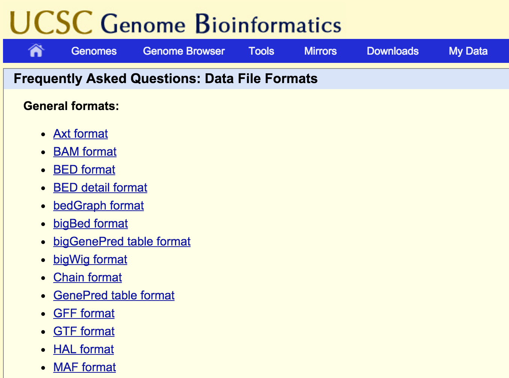

# Tertiary Analysis

- Working with BAM/SAM files

## SAM Specification

- Latest vesion SAMv1 (http://samtools.github.io/hts-specs/)

# Highlights

- Header

- Alignment Section

	- FLAG

	- POS convention (always the 5' end)
	
	- MAPQ (read MAQ paper PHRED score for Prob(mismapped))
	
	- CIGAR (Does not give mismatches; on IN/DEL; 50M!=perfect match necessarily)
	
	- MATE INFO (RNEXT, PNEXT, TLEN)
	
	- SEQ
	
	- QUAL
	
- TAGS

	- Standarized
	
	- Custom

# Flags

- major headache for humans but the right thing to do.

	- But why on earth is strand bit 4 and not bit 1; the thing you want most should be in the first bit: even == positive, odd == negative
	
	- old samtools had -X option but really not that much better
	
	Dec|Hex|Flags|Dec|Hex|Flags|Dec|Hex|Flags
	-|-|-|-|-|-|-|-|-
	65|0x41|p1|69|0x45|pu1|73|0x49|pU1
	81|0x51|pr1|97|0x61|pR1|113|0x71|prR1
	117|0x75|purR1|121|0x79|pUrR1|129|0x81|p2
	133|0x85|pu2|137|0x89|pU2|145|0x91|pr2
	161|0xa1|pR2|177|0xb1|prR2|181|0xb5|purR2
	185|0xb9|pUrR2|321|0x141|p1s|329|0x149|pU1s
	337|0x151|pr1s|353|0x161|pR1s|369|0x171|prR1s
	377|0x179|pUrR1s|385|0x181|p2s|401|0x191|pr2s
	417|0x1a1|pR2s|433|0x1b1|prR2s|1089|0x441|p1d
	1097|0x449|pU1d|1105|0x451|pr1d|1121|0x461|pR1d
	1137|0x471|prR1d|1145|0x479|pUrR1d|1153|0x481|p2d
	1161|0x489|pU2d|1169|0x491|pr2d|1185|0x4a1|pR2d

# Flags; better solution

- PICARD page is a life saver; bookmarkit or download it
https://broadinstitute.github.io/picard/explain-flags.html

# Samtools / Picard

- When there is overlap, my honest advice, use Picard

- Unless you are doing pipes/streams

	- But probably should not be doing those anyway
	
- However samtools view is prehaps the most used samfile command ever (really)

	- go over options
	
	
# PICARD

- Two main uses

	- manipulating SAM/BAMs

		- AddRG, Sort, Index & MarkDup in almost every pipeline
		
		- Mark Duplicates a key step in many cases
	
	- BAM stats
	
		- Alignment Stats
		
		- Insert Size
		
		- Duplicates Stats
	
		- and a bunch of misc other stuff

- Wins award for friendliest bioinformatics tool

# Mark/Remove Duplicates

- PCR amplification is present in almost in all library preps

- Depending on number of cycles (amount of amplifiction) you can get PCR run aways

	- a single molecule is copied 100-1,000 of times
	
- Severe problem in variant (mutation) detection

	- if that molecule had an error the error gets amplified

- Mark Duplicates is a critial part of most pipelines
	
	- And the duplication statistics are a measure of library quality

# Multi-mapper issue

* Many pipeline simple filter these reads out.

* BWA MEM problem

    * No longer sets simple flag
    
    * if using filter on MAPQ

* If using multi-mappers in uniq-mode need to really make sure:

	* how the algorithm deals with high multiplicity
	
	* random choice?
    
* Bowtie/SHRiMP for exhaustive multi-mappers

* CSEM (http://deweylab.biostat.wisc.edu/csem/)

	* impute likely position of multi-mappers by looking at surronding unique mappers. 

# Other bioinformatics file formats

## Other range formats

- BED (0-offset)

	- stand 3 column format: 
		- chromsome
		- start (first base is 0)
		- end
	
	- various extended version

- Interval List (1-offest)

	- Used by Picard: 
	- Genome Header so you know what the reference is
	- Standard 5 column format
		- Chromsome
		- Start (first base is 1)
		- End
		- Strand (REQUIRED)
		- Feature Name (REQUIRED)
	
# Other range formats, continued

- GFF/GTF: General Feature Format (1-offset)

	- 9 Columns (see http://www.ensembl.org/info/website/upload/gff.html)

		- but 9th column is a COMMENT field that can pretty much hold anything
		  arbtrary key/value pairs
	  
- GTF: General Transfer Format == GFF v2

	- GFF with "rules" (kind of) about what goes in column 9
	
# Other range formats; UCSC

## General Formats:

# Swiss Army knife of range formats

## BEDTOOLS

- Genome Arithmetic

- Handles:

	- BED
	- BAM
	- GFF/GTF
	- VCF
	
- Another package that is also very useful: GenomicRanges in `R`
