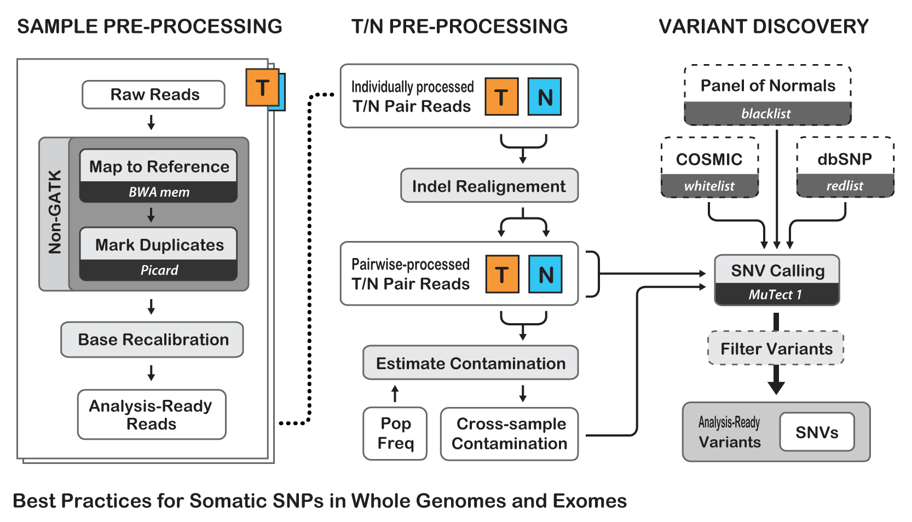

# Variant Calling Pipeline

## Primary source for lastest pipeline

* Broad / GATK Best practices

* Very complete but not 100%

    * Alternative Callers (consensus callers; Speed)

	* Stock Somatic one: missing indels

    * Annotation

        * Annotation is a difficult and rapidly changing area

        * Lots of stuff not shared (proprietary)

## BP are evolving: WARNING

> Trust, but verify.

> If someone hands you a script and tells you "this runs the GATK Best Practices", start by asking what version of GATK it uses, when it was written, and what are the key steps that it includes. Both our software and our usage recommendations evolve in step with the rapid pace of technological and methodological innovation in the field of genomics, so what was Best Practice last year (let alone in 2010) may no longer be applicable. And if all the steps seem to be in accordance with our docs (same tools in the same order), you should still check every single argument in the commands. If anything is unfamiliar to you, figure out what it does. If you can't find it in the docs, ask us in the forum. It's one or two hours of your life that can save you days of troubleshooting, so please protect yourself by being thorough.

> (https://software.broadinstitute.org/gatk/best-practices/)

## Overview




## Philosophy: import this

```python
>>> import this
```
> The Zen of Python, by Tim Peters

> Beautiful is better than ugly.
> __Explicit is better than implicit.__
> Simple is better than complex.
> __Readability counts.__
> __Errors should never pass silently.__
> Now is better than never.

## Be Explicit!

* Whenever and as much as possible want to be explicit in your pipelines:

	* Paths
	* Versions
	* Output
	* Version Stamps
	
* That goes for documention of both pipeline and results (_Readability_)

* Implicitness is nice for development but can be painful in the long run

## QC everything (errors)

* Bad data is like an error and your pipeline should try to catch as much of it as possible

* Automated QC is best but manually reviewed is better then nothing

## LABS:

### Paths/configs

### QC/FASTQ

### Clipping/Trimming

### Mapping

